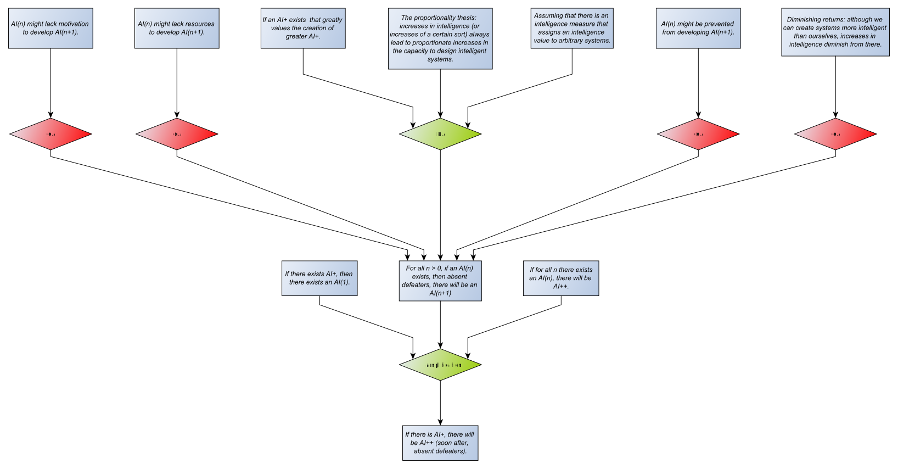

# Arguing about Artificial Intelligence

## Introduction
This is an exercise in capturing debate, on a suitably large and interesting topic, to demonstrate and develop my ideas about collecting, evaluating and explaining arguments. It's about [argumentation](https://dstl.github.io/eleatics/doc/argumentation/).

This document is commentary on the debate. I'll discuss the [technical details](technical.md) separately. 

## Existential threat
Let's start with the [singularity claim](singularity.xhtml) workbook. This grounds *the singularity claim* in essays by Good and Vinge. Next, Bostrom defines a [superintelligence](superintelligence.xhtml#superintelligence) and a case for it potentially threatening humanity. So far, there is no contention.

[Müller and Cannon](both-ways.xhtml) reconstruct the existential risk argument and attack its validity. This is an undercut, which is expressed in AIF by attacking an RA-node. Something to think about here is that the restated existential threat argument isn't exactly the one expressed by Bostrom: It uses *the singularity claim* as a premise instead of a singleton, and it doesn't use the *instrumental convergence thesis*. This doesn't affect the validity of the undercutting argument, but it does mean that there are two RA-nodes that conclude *humanity quickly becomes extinct*, and only one of them is undercut:  

We need to consider whether these two arguments are really different, or whether one is some restatement (or weaker form) of the other. If the two arguments are different, undercutting one of them leaves the conclusion valid via the other route. We'll know the undercutter is there because it will force an extension in which it is acceptable - but that extension won't materially affect the conclusions you can draw from the argument map. There's a point to make that evaluating an argument map shouldn't just be a one-shot exercise to get a final answer; it should be an iterative process that helps you assess, develop and explore argument.

In this particular case, we might need to understand the differences between 'general intelligence' and 'instrumental intelligence' - which will probably lead to asking 'what is intelligence anyway?' and 'how do you measure it?'. Alternatively, we can claim that the orthogonality thesis holds irrespective of whether the AI is generally or instrumentally intelligent, so the instrumental convergence thesis is irrelevant to the existential threat argument. I'll set those issues aside for the moment.

The other question is whether 'the technical singularity' and 'a singleton' mean the same thing in this context. At this point, I extented [superintelligence](superintelligence.xhtml#later) to capture Bostrom distancing himself slightly from 'the singularity' as a broad term, but embracing the intelligence explosion aspects of it. Others use the term *the technological singularity* to refer specifically to a superintelligent AI. Later, I may decide to make 'the technological singularity' and 'a singleton' equivalent, and think about how to model this in AIF with a MA-node.

## The singularity
The argument for existential threat depends on the singularity claim, which in turn builds on the premise of an "intelligence explosion" over a short time scale, "perhaps in the blink of an eye". In his book [The Singularity is Near](https://en.wikipedia.org/wiki/The_Singularity_Is_Near), Ray Kurzweil develops [the law of accelerating returns](accelerating-returns.xhtml) in support of this premise. Some arguments against the singularity, such as [the complexity brake](complexity-brake.xhtml), question the exponential nature of the intelligence explosion.

David Chalmers published [a philosophical analysis of the singularity](chalmers.xhtml) that constructs and discusses the argument for the singularity and potential defeaters. This provides a useful framework for assessing arguments about superintelligent AI. For example, the analysis suggests that *the amplification premise* is the most contentious:

As depicted, the supporting and conflicting arguments are on an equal footing. Evaluation gives two extensions: either all the defeaters are acceptable and the amplification premise isn't, or none of the defeaters are acceptable but the amplification premise is. This sort of argument map is therefore expressing possible alternatives rather than reaching a definite conclusion. You have to defeat the opposing arguments if you want the evaluation to come down firmly on one side or another. Chalmers argues for the amplification premise by defeating the defeaters: the "AI+ greatly values the creation of greater AI+" defeats any motivational objection; the proportionality thesis counters diminishing returns; preventive methods are unlikely to be maintained; and resources are likely to be sufficient. Evaluation now gives one extension in which the amplification premise is acceptable. We might then add a new counter, suggesting that [the complexity brake](complexity-brake.xhtml) defeats the proportionality thesis. This reverses the previous situation, giving a single extension where the amplification premise is not acceptable. Chalmers might then contend that the complexity brake is a diminishing returns argument that is defeated by the proportionality thesis. This would produce mutual attacks between the complexity brake and the proportionality thesis, and we're back to two extensions with no clear answer. Breaking this kind of deadlock means drilling down into the opposing arguments - which Chalmers does do for the proportionality thesis.

## Where next?

From what I've read so far, most people arguing against the singularity focus on [the amplification premise](chalmers.xhtml#amplification), with some of the proposed defeaters applying also to [the extension premise](chalmers.xhtml#extension).

-- full argument
-- modularity
Can we break this down into meaningful sub-arguments? This sort of thing seems to happen in the literature anyway, with a potentially complex network of arguments condensed into a single "thesis" I-node in and argument map. Toulmin.

We need to consider the [terminology](technical.md#terminology) used by different parties in the debate and decide when different terms mean the same thing. For example, Chalmers considers three classes of artificial intelligence: AI, AI+ and AI++. The first is human-level intelligence (meaning Artificial General Intelligence, AGI), the second is greater than human intelligence (of the sort that triggers the intelligence explosion), and the third is the singularity (or artificial superintelligence, ASI). Chalmers doesn't distinguish between general and instrumental intelligence, but he does seek to deflect aruments about the nature of intelligence with a rephrasing of the amplification argument in terms of correlated cognitive capacities. Again: what is intellgence anyway?

... *work-in-progress*