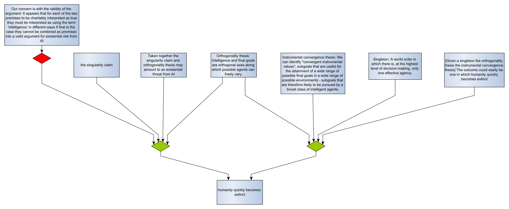

#Arguing about Artificial Intelligence

##Introduction
This is an exercise in capturing debate on a suitably large and interesting topic, with the aim of demonstrating (and further developing) ideas about collecting, evaluating and explaining arguments. This is [argumentation](https://dstl.github.io/eleatics/doc/argumentation/).

The only fixed technical point is the use of [Argument Interchange Format (AIF)](https://www.arg-tech.org/wp-content/uploads/2011/09/aif-spec.pdf) to model argument and dialogue. AIF gives a common structure that all parties can use. Arguments link through shared premises and conclusions to form *argument maps*. If different parties use the same identifier when they refer to the same claim, their respective lumps of AIF can be added together and the 'linked data' nature of AIF will make the connections. I'll discuss constructing and evaluating AIF argument maps in a separate [technical details](technical.md) page.

Debate is an iterative process. The purpose of this document is to provide a running commentary ...

## Existential threat
Let's start with the [singularity claim](singularity.xhtml) workbook. This grounds *the singularity claim* in essays by Good and Vinge. Next, Bostrom defines a [superintelligence](superintelligence.xhtml#superintelligence) and a case for it potentially threatening humanity. So far, there is no contention.

[Muller and Cannon](both-ways.xhtml) reconstruct the existential risk argument and attack its validity. This is an undercut, which is expressed in AIF by attacking an RA-node. Something to think about here is that the restated existential threat argument isn't exactly the one expressed by Bostrom: It uses *the singularity claim* as a premise instead of a singleton, and it doesn't use the *instrumental convergence thesis*. This doesn't affect the validity of the undercutting argument, but it does mean that there are two RA-nodes that conclude *humanity quickly becomes extinct*, and only one of them is undercut:  

A lesson here is that we need to consider whether two arguments that reach the same conclusion are really different, or whether one is some restatement (or weaker form) of the other. If the two arguments are different, undercutting one of them leaves the conclusion valid via the other route. We'll know the undercutter is there because it will force an extension in which it is acceptable - but that extension won't materially affect the conclusions you can draw from the argument map. There's a point to make that evaluating an argument map shouldn't just be a one-shot exercise to get 'the answer'; it should be an iterative process that helps you assess, develop and explore argument.

In this particular case, we need to understand the differences between 'general intelligence' and 'instrumental intelligence'. Also to decide if 'the technical singularity' and 'a singleton' mean the same thing, in this context at least.

## The singularity
The argument for existential threat depends on the singularity claim, which in turn builds on the premise of an "intelligence explosion" over a short time scale ("perhaps in the blink of an eye"). In his book [The Singularity is Near](https://en.wikipedia.org/wiki/The_Singularity_Is_Near), Ray Kurzweil develops [the law of accelerating returns](accelerating-returns.xhtml) in support of this premise. Some arguments against the singularity, such as [the complexity brake](complexity-brake.xhtml), question the exponential nature of the intelligence explosion.

*work-in-progress*