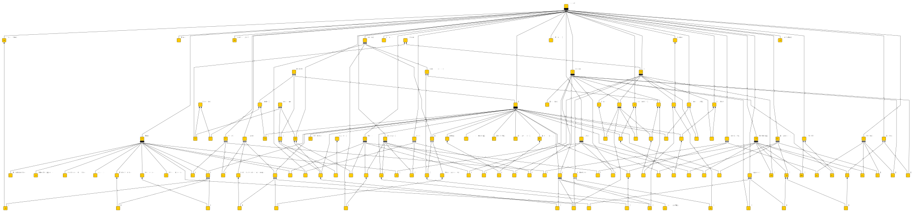
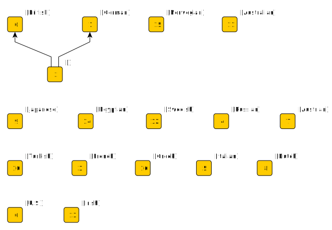
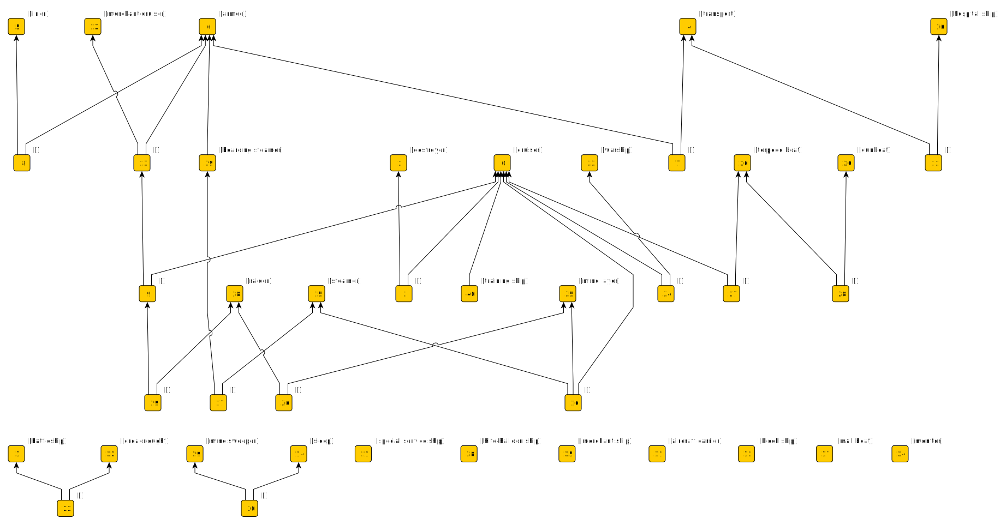

# Formal concept analysis

This example draws on data published by the [Royal Hampshire Regiment Museum](https://tigersmuseum.github.io/history/). The starting point is a file called [ships.txt](https://tigersmuseum.github.io/history/events/ww1/ships.txt), which is a list of noun phrases about ships taken from the WW1 chronologies mentioned on the [World War I](https://tigersmuseum.github.io/history/docs/ww1.html) page.

The chronologies are machine-readable XHTML. The proper names of any ships mentioned are inside HTML *span* elements with a *class* attribute set to *vessel*. This makes it easy to create a dictionary of ship names from the chronologies. I've also hand-crafted a dictionary of nationalities, and a dictionary covering the types of ship mentioned in the noun phrases. In general, noun phrases describing an entity will contain adjectives and nouns that can be considered attributes of the entity. The phrases in [ships.txt](https://tigersmuseum.github.io/history/events/ww1/ships.txt) may include proper names, the classes of ship, and nationalities.

[Formal concept analysis (FCA)](https://en.wikipedia.org/wiki/Formal_concept_analysis) is a method that takes objects and attributes and constructs a *concept lattice*. Each node in the lattice represents a *concept* associated with zero or more objects and zero or more attributes. Each object and attribute appears in the lattice only once. In a lattice diagram, an object attached to a concept node is associated with all the attributes reachable by moving up the diagram, and an attribute attached to a concept node is associated with all the objects reachable by moving down the diagram. 

I can treat each noun phrase in [ships.txt](https://tigersmuseum.github.io/history/events/ww1/ships.txt) as an object, and hits in the ship name, ship type, and nationality dictionaries as attributes. More interestingly, I can use the ship names dictionary to collect all noun phrases that mention the same ship and make each of these an object. Hits on the ship type and nationality dictionaries are the attributes. This assumes that all mentions of the same name are about the same ship, and it means that an attribute, such as nationality, need only appear in one of the phrases to be associated with that ship. I can then apply FCA to make the following lattice:

This is the GraphML procuded by the FCA implementation in my [argumentation](https://github.com/knoxa/argumentation/tree/main) repository, loaded into yEd and exported as SVG. There isn't a layout method for lattice diagrams in yEd, so I've laid this out hierarchically, and made the edges directed so that they point "upward" towards the most common attribute. The attribute labels appear on the diagram beside concept nodes. The object labels aren't visible, but you'll see them if you open the image in a new tab and mouse over concept nodes. This lattice has a *TOP* element (everything is a 'vessel'), but I haven't bothered to add a *BOTTOM* element.

There's a lot of information in the above diagram, but it isn't easy to pick out. I can reduce the clutter by considering the nationality and ship type attributes separately. With the same objects (sets of phrases that mention the same proper name), and nationality as the only possible attribute, I get:

I've also taken out the *TOP* element here to reduce clutter further. The result is essentially partioning the objects (ships) by nationality. You'd expect each ship to belong to just one nation, but concept node 2 links to both British and German. This node is "Ariadne", and the text phrases associated with the "Ariadne" object are:

	THE STEAMSHIP ARIADNE
	GERMAN LIGHT CRUISERS "KÖLN," "MAINZ," AND "ARIADNE"
	H.M.S. ARIADNE (MINE LAYER)	

My assumption that phrases mentioning the same ship name are about the same ship is wrong in this case. There are in fact 3 ships called "Ariadne".

If I take ship type as the only attribute I get:

In this case, I don't expect ship types always to be described in the same way because the text phrases come from two different authors, and even the same author might not use consistent terms. For example, objects associated with concept node 23 are both "battleship" and "dreadnought" which is perfectly reasonable. I can look at other combinations of ship type and see if they make sense. I might question "mine sweeper" and "sloop" for "Gaillardia" and "Genista" at concept node 30, but the phrases are:

	THE BRITISH MINE-SWEEPING SLOOP GAILLARDIA
	THE BRITISH MINE-SWEEPING SLOOP GENISTA

Other combinations don't make sense. For example, at concept node 27, the ship "Herrmann" is both "cruiser" and "torpedo boat". The phrases are: 

	THE GERMAN AUXILIARY CRUISER HERRMANN
	THE GERMAN AUXILIARY CRUISER HERRMANN AND TWO GERMAN TORPEDO BOATS

So, if the noun phrase is a conjunction, then it may be about two entities rather than one, again breaking the assumption that each set of phrases is about a single ship. A subtle point here is that two *named* entities in the same phrase doesn't always cause a problem:

	THE BRITISH TRANSPORTS CAMERONIA (140 LIVES LOST) AND ARCADIAN (279 LIVES LOST)
	
This phrase is associated with two objects: "Cameronia" and "Arcadian", and they both have the attribute "transport". However, you can have two named vessels of different types in the same phrase, or you can have a named vessel with an unnamed vessel of a different type. For example:

	H.M.S. UNDAUNTED (CRUISER)
	H.M.S. "UNDAUNTED" AND DESTROYERS
	
gives an "Undaunted" object with both "cruiser" and "destroyer" attributes.

The object "Ariadne" is at concept node 16 and has attributes "steamer", "mine layer" and "cruiser" - an odd combination. The same issue about there being more than one "Ariadne" might be discovered from this lattice as well as the nationality one.

The basic approach here is to treat sets of strings as objects and labels as attributes. If there is some structure on the sets of strings (they all mention  the same ship name say), and there is some meaning to the labels (a nationality label say) then I can expect that structure to be reflected in the attributes (each ship belongs to one nation). I can make some modelling assumptions, construct objects and attributes accordingly, then create the concept lattice and test assumptions. I can use NLP in constructing the objects (noun phrase chunking) and I can use NLP in checking results (determining is a noun phrase contains a conjunction).

In a complete lattice, objects without attributes are associated with the *TOP* concept. If I include it, I can find named ships where the nationality or type is not included in a noun phrase that mentions the ship name, though it may be elsewhere in the sentence. I can imagine an NLP process that takes the sentences containing such noun phrases and identifies the missing attributes - or I can just go through them manually. Either way, I can record the results as simple sentences:

	Arabis is a British mine-sweeper.
	Nur el Bahr is an Egyptian coastguard cruiser.
	S.S. Gulflight is American.
	Paragon is a British Destroyer.
	The Intrepid, Thetis, and Iphigenia are three obsolete British cruisers.
	The Brilliant and Sirius are British block ships.
	Scharnhorst, Gneisenau, Leipzig, and Nürnberg are German warships.
	The Surprise, Tornado, and Torrent are British destroyers.
	The Staunch is a British destroyer.
	The Orama is a British armed merchant-cruiser.

If I add these to my list of noun phrases, I can subject the total to the process described above and get the results I would expect. Also, in cases where analysis of a concept lattice challenges an assumption, I can consider these statements as "truth" if they're part of some object.

I can also add to the mix a statement like:

	There are 3 different ships called Ariadne.

This doesn't affect the concept lattice structure at all, but what it does do is add that sentence to the collection of strings in the "Ariadne" object. This is at least a reminder that "Ariadne" is ambiguous. It might prompt me to disambiguate the object if I'm interested in distinguishing between the vessels, or I can just leave it like that if I'm not.

Above, I made an assumption that a name equates to an identity and found a case (Ariadne) that contradicted this assumption. There is also a contrary case where the same entity has two different names. For example, the chronologies data sometimes has the same vessel named with different spellings:

	TURKISH BATTLESHIP "MESSOUDIEH"
	THE TURKISH BATTLESHIP MESSUDIYEH

If these strings are from two different objects ("Messoudieh" and "Messudiyeh") then both objects end up at the same node in the concept lattice because they are both "turkish" and "battleship". It's easy to judge they might be variations on the same name by eye, or by some NLP algorithm such as Soundex. If one or other were described as "dreadnought" rather than "battleship" then they wouldn't appear at the same concept lattice node. However, they would be close to each other in the lattice because other noun phrases in the input bring the attributes "battleship" and "dreadnought" together. The dictionaries I use allow preferred and alternative labels, so I can associate both names with a preferred transliteration, [Mesudiye](https://en.wikipedia.org/wiki/Ottoman_ironclad_Mesudiye), and make one object containing both strings.

## Things to think about

Concept lattices relate objects through common attributes and attributes through common objects. It's useful in ontology.

Can FCA be used as part of a NLP process to extract information from text? FCA can certainly be used to derive structured results from the output of NLP, but it might also be useful internally to some NLP process to check progress and direct the focus of specialist NLP algorithms.

It's a modelling choice to decide what constitutes an object or attribute. How do concept lattices compare if the same data is modelled in different ways? Does comparing alternative models of the same data provide extra insights?
