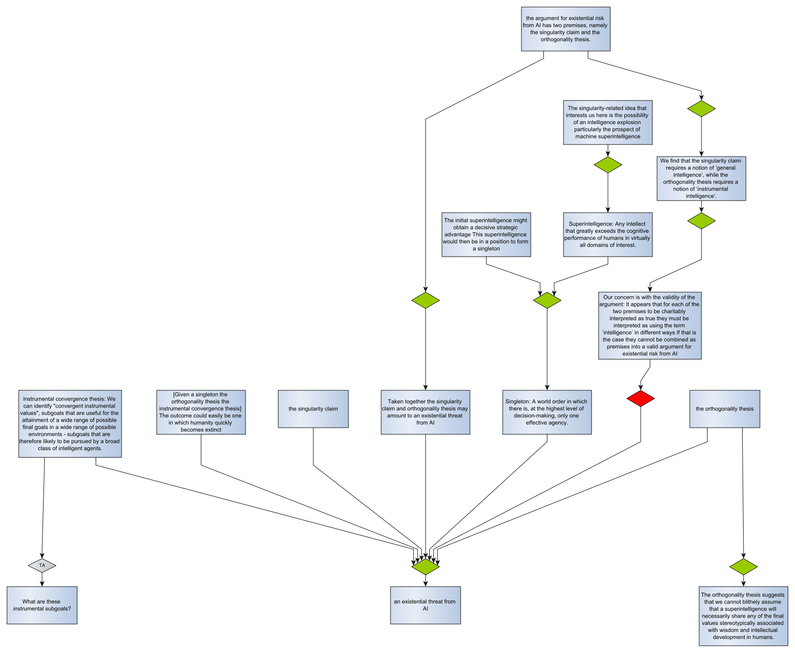
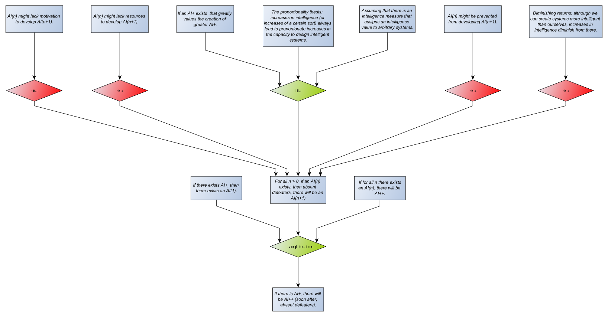

# Arguing about Artificial Intelligence

## Introduction
This is an exercise in capturing debate, on a suitably large and interesting topic, to demonstrate and develop ideas about collecting, evaluating and explaining arguments. It's about [argumentation](https://dstl.github.io/eleatics/doc/argumentation/). This document is commentary on the debate. I'll discuss the [technical details](technical.md) separately. 

## Existential threat
Let's start with the [singularity claim](singularity.xhtml) workbook. This grounds *the singularity claim* in essays by Good and Vinge. Next, Bostrom defines a [superintelligence](superintelligence.xhtml#superintelligence) and a case for it potentially threatening humanity. So far, there is no contention.

[Müller and Cannon](both-ways.xhtml) reconstruct the existential risk argument and attack its validity. This is an undercut, which is expressed in AIF by attacking an RA-node. Something to think about here is that the restated existential threat argument isn't precisely the one expressed by Bostrom: It uses *the singularity claim* as a premise instead of a singleton, and it doesn't use the *instrumental convergence thesis*. I think it's essentially the same though, so I've use the same URI for the RA-node in both the original and restated versions. This means the two lumps of AIF will merge accordingly. The result looks like this: 

To pursue this further, we might need to understand the differences between 'general intelligence' and 'instrumental intelligence' - which will probably lead to asking 'what is intelligence anyway?' and 'how do you measure it?'. Alternatively, we can claim that the orthogonality thesis holds irrespective of whether the AI is generally or instrumentally intelligent, so the instrumental convergence thesis is irrelevant to the existential threat argument. I'll set those issues aside for the moment.

The other question is whether 'the technical singularity' and 'a singleton' mean the same thing in this context. Bostrom distances himself slightly from 'the singularity' as a broad term, but embraces the intelligence explosion aspects of it. Others use the term *the technological singularity* to refer specifically to a superintelligent AI. Later, I may decide to make 'the technological singularity' and 'a singleton' equivalent, and think about how to model this in AIF with a MA-node.

## The singularity
The argument for existential threat depends on the singularity claim, which in turn builds on the premise of an "intelligence explosion" over a short time scale, "perhaps in the blink of an eye". In his book [The Singularity is Near](https://en.wikipedia.org/wiki/The_Singularity_Is_Near), Ray Kurzweil develops [the law of accelerating returns](accelerating-returns.xhtml) in support of this premise. Some arguments against the singularity, such as [the complexity brake](complexity-brake.xhtml), question the exponential nature of the intelligence explosion.

David Chalmers published [a philosophical analysis of the singularity](chalmers.xhtml) that constructs and discusses the argument for the singularity and potential defeaters. This provides a useful framework for assessing arguments about superintelligent AI. For example, the analysis suggests that *the amplification premise* is the most contentious:

As depicted, the supporting and conflicting arguments are on an equal footing. Evaluation gives two extensions: either all the defeaters are acceptable and the amplification premise isn't, or none of the defeaters are acceptable but the amplification premise is. This sort of argument map is therefore expressing possible alternatives rather than reaching a definite conclusion. You have to defeat the opposing arguments if you want the evaluation to come down firmly on one side or another. Chalmers argues for the amplification premise by defeating the defeaters: the "AI+ greatly values the creation of greater AI+" defeats any motivational objection; the proportionality thesis counters diminishing returns; preventive methods are deemed unlikely to be maintained; and resources are deemed likely to be sufficient. Evaluation now gives one extension in which the amplification premise is acceptable. We might then add a new counter, suggesting that [the complexity brake](complexity-brake.xhtml) defeats the proportionality thesis. This reverses the previous situation, giving a single extension where the amplification premise is not acceptable. Chalmers might then contend that the complexity brake is a diminishing returns argument that is defeated by the proportionality thesis. This would produce mutual attacks between the complexity brake and the proportionality thesis, and we're back to two extensions with no clear answer. Breaking this kind of deadlock means drilling down into the opposing arguments - which Chalmers does do for the proportionality thesis. Something to look into ...

## Where next?

Bostrom's argument for existential risk assumes an all-powerful singleton. It depends on the singularity happening really fast to make it plausible that one AI project can suddenly expand to superintelligence and suppress all competition before any others can follow suit. With less than hyperbolic expansion to singularity there might be more than one AI reaching superintelligence, so no singleton. It's a challenge to analyse arguments where claims are hypothetical future events and their plausibility depends on sequence and timing. Use of [argumentation schemes](https://github.com/dstl/eleatics/wiki/Argumentation-Schemes) might help.

From what I've read so far, most people arguing against the singularity focus on [the amplification premise](chalmers.xhtml#amplification), with some of the proposed defeaters applying also to [the extension premise](chalmers.xhtml#extension). See, for example, [Against the singularity hypothesis](https://doi.org/10.1007/s11098-024-02143-5). There's more that could be done here to tease these arguments out. Even without *existential* risk, there is plenty of potential risk from superintelligent AI, so this topic is worth taking further.

I think where argumentation is useful in this debate is in understanding what some of the more vague and sensational claims actually mean. One way to do this is to raise and answers [questions](technical.md#questions) about those claims. These can be part of the wider dialogue. Questions and answers might just be for information, prompting the definition of [terms](technical.md#terminology) such as [intelligence](intelligence.xhtml) and [how to assess it](levels-of-agi.xhtml), or they might play a role in evaluating arguments. For example, I may choose not to accept claims with unanswered questions. I can start by raising a few [some questions](questions.xhtml).
