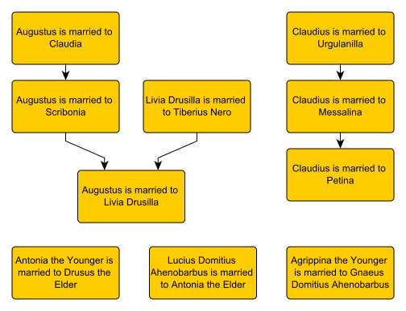

# Marriage

From [family.xhtml](family.xhtml) I can generate [marriage.graphml](marriage.graphml), which looks like this ...

## How it works

The first 3 steps are the same as for the [Julio-Claudian Family Tree](family.md) example - and [family.xsl](../../xsl/family.xsl) pulls out marriages as well as parent-child relationships.

The final step applies [marriage-graph.xsl](../../xsl/marriage-graph.xsl) to make GraphML. It links each marriage to the next mentioned that has a spouse in common. The idea is that each marriage is a non-overlapping time interval, and this constructs a partial ordering of these intervals. The assumption is that marriages are listed in chronological order. If this assumption is invalid (as it was in this example) then the graph needs to be manually corrected (and the corrected version is shown.) The results define a preorder.
