# Pentominoes

I want to fill a board with 60 squares and get them to self-organize into the 12 distinct [pentominoes](https://en.wikipedia.org/wiki/Pentomino).

I'll start with an easier proposition, which is to simply fill the board with pentominoes of any type. The following algorithm does this:

* Partition the board into tiles. Initially, all the tiles will be of size 1.
* While there are no tiles of size 6 or more, randomly select one of the tiles of smallest size.
* Find the neighbouring tiles that touch this tile. Have a square defect from the selected tile to a smallest neighbour.
The defector is chosen at random when there is more than one square that could defect.
* If a tile gets to size 6 it is 'dissolved', which is to say that all its component squares are detached.
* Stop when all tiles are of size 5.

I typically get something like this:

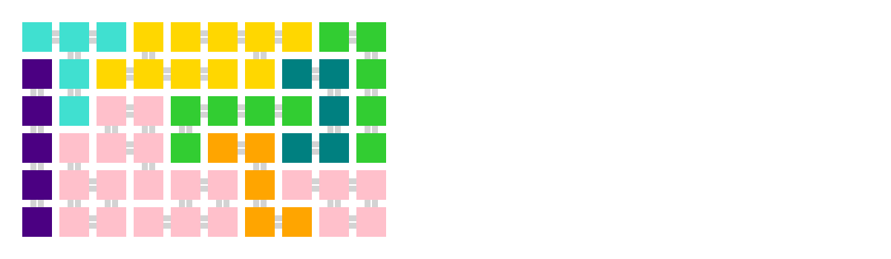

This has 7 different pentominoes.
Theoretically, I can get all 12 pentominoes if I repeat this process often enough.
However, some pentominoes are more likely to appear than others, and it might take a long time to get a solution.
I'd like to force the pace.

I can try starting the pentomino forming procedure with some pentominoes already in place. For example, I can dissolve any duplicate
pentominoes from the first run ...

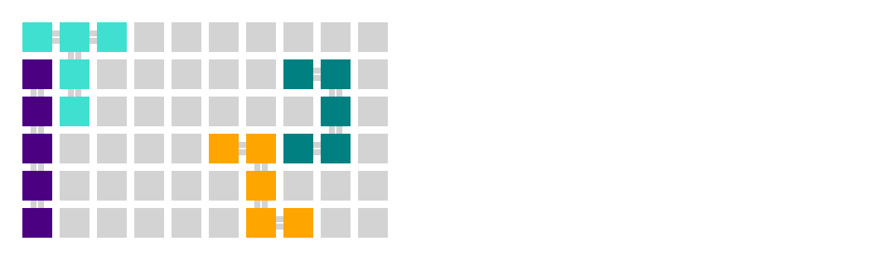

... and try again:

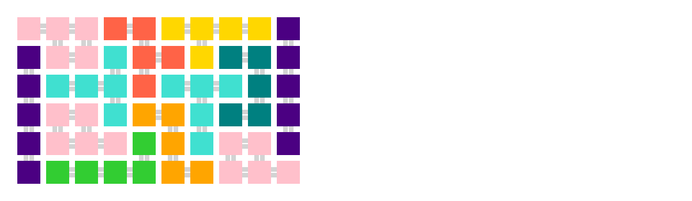

I now have 8 different pentominoes, but repeating the procedure again isn't necessarily going to improve the situation.
One problem is that the the procedure doesn't always preserve the pentominoes that were in the start state, so the number of distinct tiles
doesn't monotonically increase. 
Another problem is that small, isolated groups of squares are likely to reform exactly the tiles that were dissolved to make them.
I can address both problems by changing the pentomino dissolving strategy to select contiguous tiles.

With this as my next starting point ...

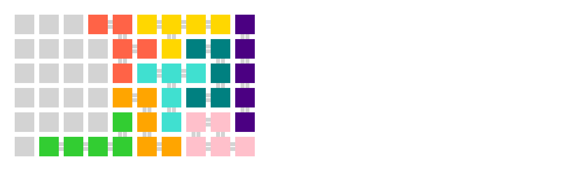

and get ...

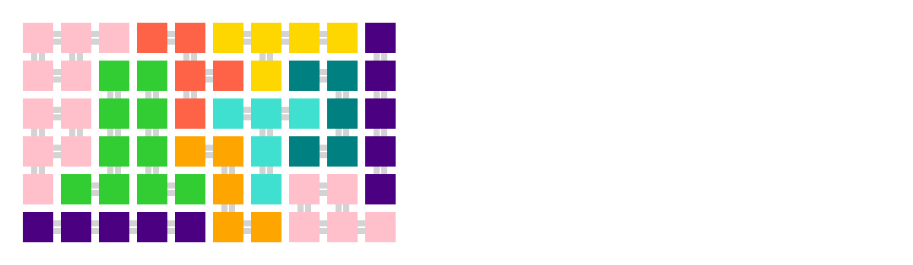

... but this may still alter tiles in the starting state, such as the I-pentomino along the bottom edge.
I can fix this by altering the sensed environment in the start state to include only tiles of size one.
The fixed pentominoes become 'invisible' and play no part in the algorithm.

I can proceed along these lines, but success is not guaranteed because the part of the board I've fixed may not be part of a valid solution.
I am likely to find that the last two or three tiles I need to fit can't be arranged in the space available.
Above, for example, I have an X-pentomino and W-pentomino still to fit - and it's not clear that they go.

Something different I can try is to transform pentominoes instead of dissolving and reforming them.
One method has a square leaving a pentomino and attaching to one of its neighbours, which disgorges another square in turn.
A singleton square thus moves from tile to tile until it joins the tetronimo created in the first step, halting the process.
I can make this operate in a limited area of the board by restricting the sensed environment as above.
Another method is to transform an adjacent pair of pentominoes to produce an alternate pair covering the same ground.

These pentomino transformations allow a partial solution to be changed within the same area of the board, leaving a different set of remaining tiles that might be easier to fit.
Transformations could be usefully exploited if some planning step is included, but aren't helpful if they are chosen randomly.

To get a feel for the planning problem, I proceeded step-by-step to try out various combinations of operations and see if I could get to a solution.
I soon got to this point:

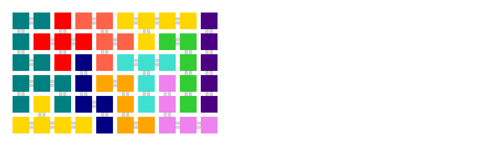

This has 10 unique pentominoes. A missing U-pentomino and Y-pentomino need to replace a W-pentomino and P-pentomino.
This is a hopeful situation because the P-pentomino is the easiest to produce, randomly or by transformation, and there is a U-pentomino next to a Y-pentomino at the bottom-left of the board. Unfortunately, the W-pentomino is awkward and won't fit into the space.
The nearby X-pentomino and U-pentomomino can't be moved into that space either. I'm painted into a corner.

What I do notice though is that the X-pentomino and F-pentomino can swap places by transformation ...

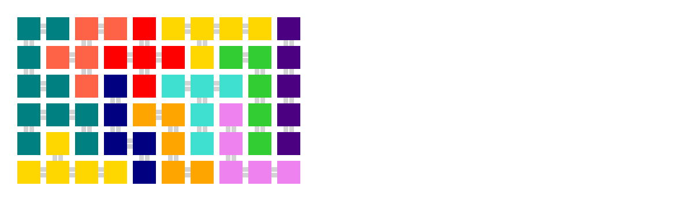

... which gives a bit more working room at the left of the board. Proceeding as before, I clear spaces, create tiles that fit, and try to transform this to fit the more awkward tiles.
I can get the W-pentomino and F-pentomino fixed, then the N-pentomino and the Z-pentomino, moving the focus of my attention along the bottom of the board as I go.
When I get to this point ... 

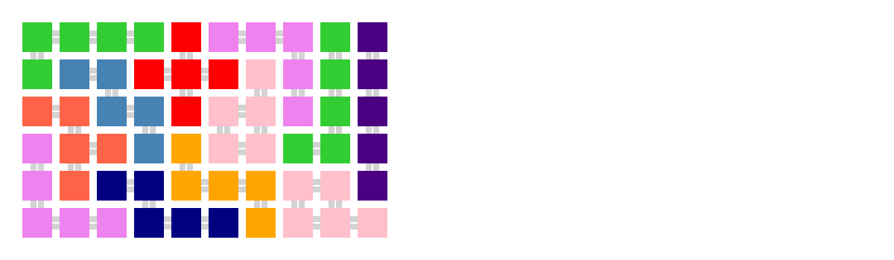

... the end is in sight. There are 9 distinct pentominoes. I'm missing the Y-pentomino, U-pentomino, and T-pentomino. The V-pentomino, P-pentomino and L-pentomino are repeated, but there are three of them together in an almost square block near the top-right of the board. I can see that the tiles I need would fit, but it's not clear
how to get there by pairwise transformations. However, I can dissolve the repeated tiles ...

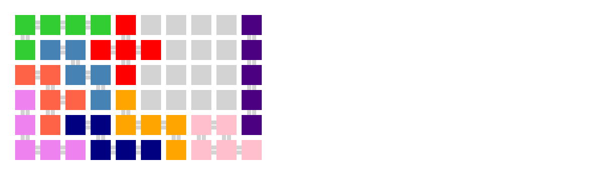

... and fill the gap.

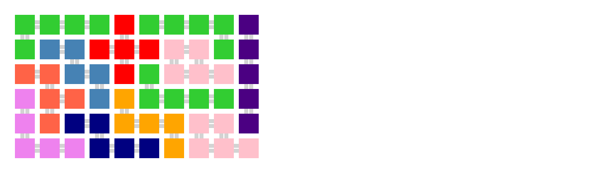

... then transform an L-pentomino and the P-pentomino to give a T-pentomino and P-pentomino ...

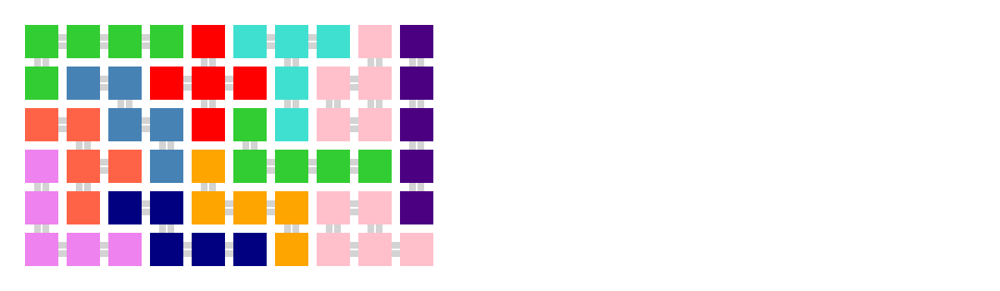

.. then transform the newly created P-pentomino and the other L-pentomino to give a solution:

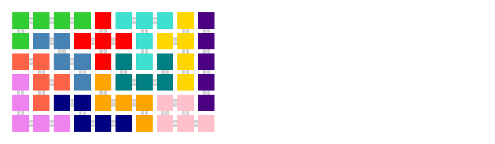

It's possible to get from a degenerate solution (with duplicate pentominoes) to a proper solution (all 12 pentominoes) by transforming pairs of tiles,
 in some cases at least. 