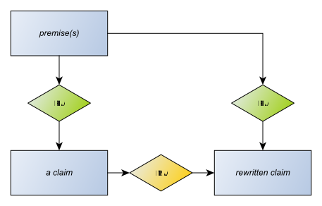

# Rewriting claims

If I rewrite a claim, I create a new claim that has the same premises, and link the old claim to the new with an MA-Node.

I don't make the old claim a premise of the new because there may be cases where the original claim is unacceptable and the new claim isn't. For example, the claim as first made is ambiguous; and the rewritten claim clarifies it.

## As semantic mark-up
In this [XHTML example](rewrite.xhtml), I have a claim derived from text where an entity name is unambiguous in the scope of text quoted, but will be ambiguous in any wider scope. I allow for this by putting all entity names mentioned in claims inside HTML *span* elements. Later, when I need to be more specific about the name, I use the [RDFa](https://www.w3.org/TR/xhtml-rdfa-primer/) trick of adding a *content* attribute to the span to overrule its text context, and add a 'rewrite rule' claim.