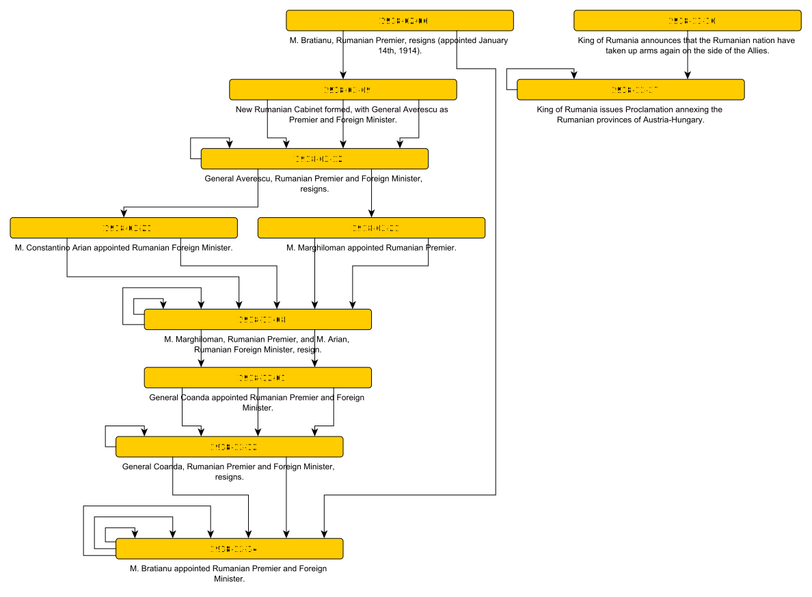
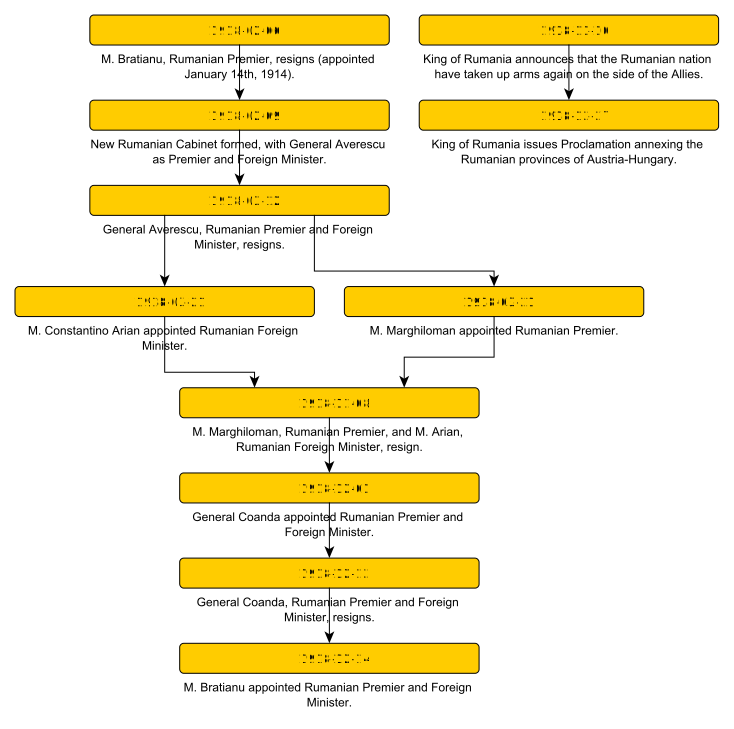
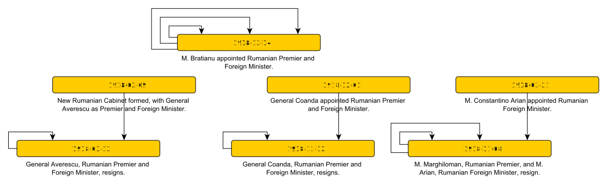
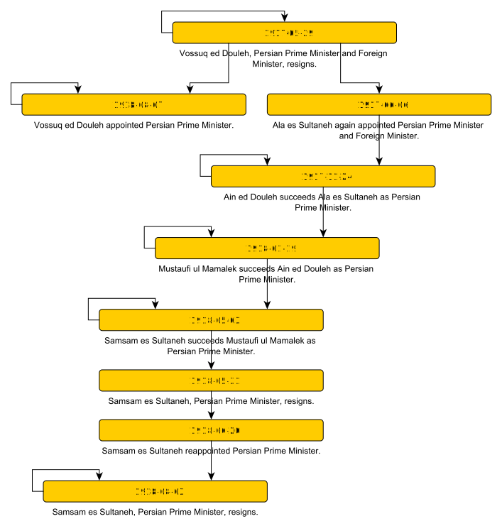

# Entities linking events

This is about making sense of a chronology of events through the mention of common entities. Concrete and identifiable entities (such as people or cities) have a _timeline_. That is to say a chain of events, ordered in time, in which they play part. Abstract entities (such as roles) might be considered in a way that renders them concrete, or perhaps thought of as describing the _state_ of a concrete entity. The proposition is that graphs linking events through mention of common entities encode information about the nature of those entities and their relationships. Let's explore ...

These are events from _[Principle Events 1914-1918](https://tigersmuseum.github.io/history/events/ww1/events-1918.xhtml)_:

I've made use of the semantic mark-up in the file to select 1918 events that mention "Rumania" and at least one person. For each entity mentioned in an event, I've linked the event to the next that mentions the same entity, or to itself if the entity is not mentioned again. If you open [the image](romania1.svg) in a separate window, and "mouse over" the edges in the graph, you'll see the entity used to make each link.

Information can be inferred from [this graph](.romania1.graphml). For example, apart from the King, the source only mentions Romanians in 1918 in the context of changes in political office. I can build a political timeline. More on that later. 

If I reduce multiple links between nodes, remove self-links, and restrict the graph to covering relations, I get ...

... which is easier to follow as a timeline of political events. I've done something similar with the Royal Hampshire Regiment Museum's [diary of events](https://tigersmuseum.github.io/history/events/rhants/eventdiary.xhtml) to create a [First World War timeline](https://tigersmuseum.github.io/history/examples/ww1.svg). Note that this graph is a partial order of events in time. It renders incomparable those events that can't be linked a chain of entities. It might therefore be useful in causal reasoning.

## Sensemaking
Each node in the above graphs relates to an event in the source XHTML. I can make lots of graphs from the source material in lots of ways. I can selectively build graphs by limiting which events I choose, e.g. {"Rumania", 1918, type = _person_} and try and interpret them; or I can construct larger graphs and whittle them down to something that makes more sense. For example, I can take the original graph above and restrict it to just nodes that mention _Rumanian Foreign Minister_, then remove any edge where the entity is not of type _person_: 

Each component of this graph suggests a hypothesis about who was Romanian Foreign Minister in a particular time span, with the events as evidence. Some other agent (that understands words like "appointed" and "resigns" perhaps) can check these hypotheses.

Trying the same trick with _Persian Prime Minister_ for 1917 and 1918 gives

This graph doesn't have separate components for each term in office because one person "succeeds" another, so the incumbent is the edge coming into the node and successor is the outgoing edge - but I can still naively generate hypotheses about terms in office from this structure based on the first and last mention of each person. These aren't necessarily going to be correct. For example, it'll be a period out of office, not in office, for _Vossuq ed Douleh_ who "resigns" when first mentioned and is later re-appointed.

These graphs might also raise questions. For example, in the case of _Samsam es Sultaneh_ above, I can hypothesise that he was in office between May 5th and August 8th, but he resigned on May 31st and was re-appointed on June 20th. Was someone else in office in that gap? If not, what brought him back so quickly? It's simple enough to get all events relating to Persia in that timeframe and order them simple by time. The only intervening event is:

	June 14th: Tabriz (North Persia) again occupied by Turkish forces
  
Which, though suggestive, is frustratingly inconclusive. We don't always get answers though, and [his Wikipedia page](https://en.wikipedia.org/wiki/Najaf-Qoli_Khan_Bakhtiari) doesn't help. It doesn't show this gap, and has an end date for this term in office that is several days later, raising further questions.

# NLP
The examples here exploit very simple natural language processing (NLP), applied to source text, then captured in the source as semantic mark-up. All that is needed is named entity recognition (NER), plus co-reference resolution to ensure that the same name is always used for a specific entity - so, for the example above,

	"M. Arian" refers to M. Constantino Arian
	
which is accounted for in the source text by setting the _@content_ attribute on a HTML _span_ element surrounding the entity name. I've used the entity type (from NER) in selecting data for the examples, but I could still do something useful without knowing any entity types - and infer something about those types from the events in which they play a role. Classifying entities by type will be useful in reasoning about them, but I don't have to commit to any specific ontolology if my chain of reasoning is rooted in the source text. 