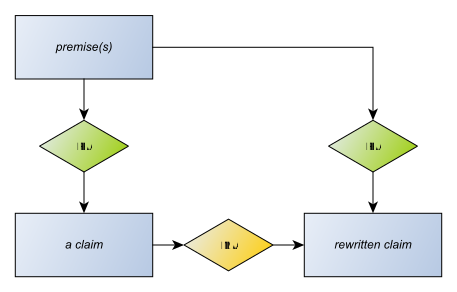

# Rewriting claims

If we rewrite a claim, we create a new claim that has the same premises, and link the old claim to the new with an MA-Node.

We don't make the old claim a premise of the new because there may be cases where the original claim is unacceptable and the new claim isn't. For example, the claim as first made is ambiguous; and the rewritten claim clarifies it.

In the [family tree example](../examples/family/workbook.xhtml), we have claims derived from text where an entity name is unambiguous in the scope of text quoted, but will be ambiguous in any wider scope. We can deal with this by putting entity names mentioned in claims inside HTML *span* elements. Later, if we want to be more specific about the name, we can use the [RDFa](https://www.w3.org/TR/xhtml-rdfa-primer/) trick of adding a *content* attribute to the span to overrule its text context.