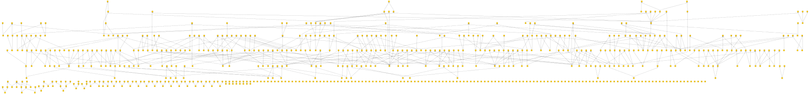
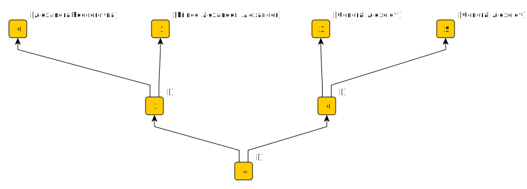
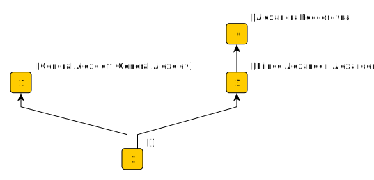
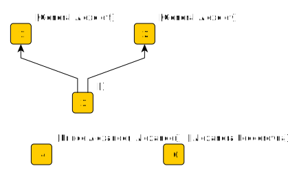
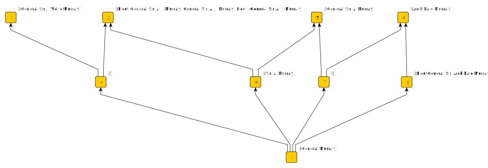
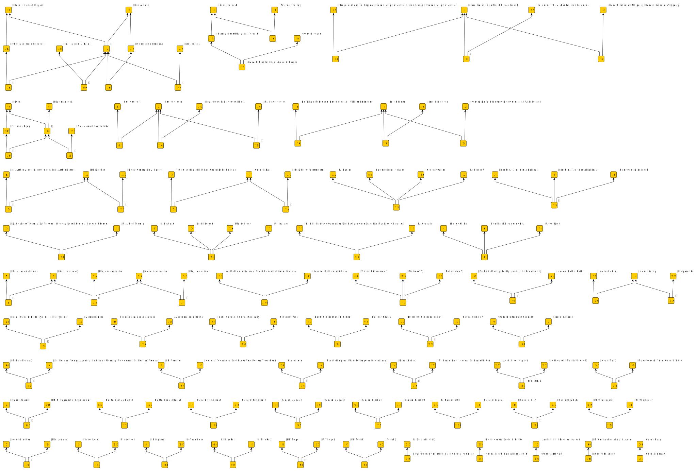
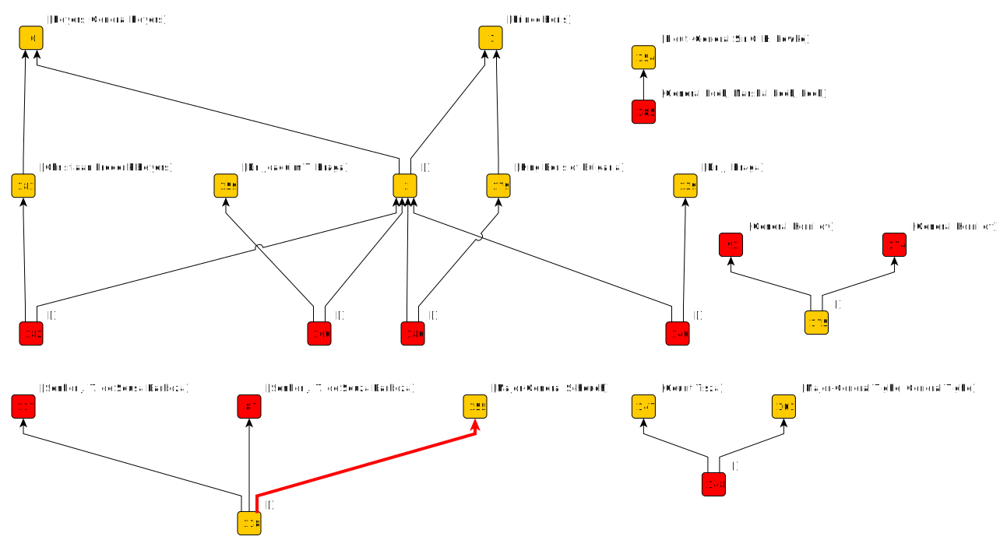
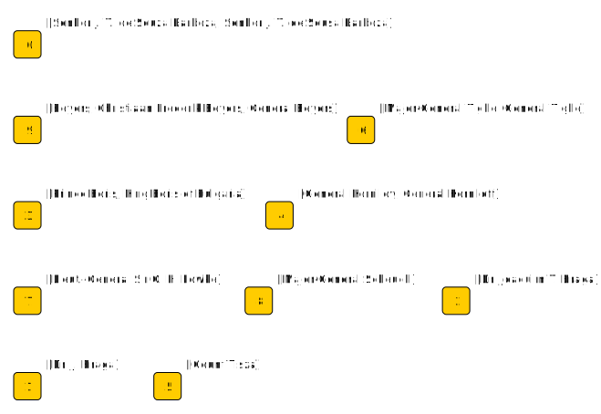

# Names of people

A person's name can be expressed in many different ways. Resolving which expressions refer to the same person is [entity disambiguation](https://en.wikipedia.org/wiki/Entity_linking).

I can take a name and split it up into tokens. Each name is then associated with a set of tokens and similar names are related by intersections of
these sets. I can play around with options for generating tokens. For example, it might make sense to normalize the tokens in various ways: reduce everything
to lower case, remove diacritical marks, apply a phonetic encoding (such as [Soundex](https://en.wikipedia.org/wiki/Soundex)), and so on.
I can add one or modified tokens to each set in addition to the original tokens, or I can replace original tokens with the modified ones.
I can make a [stop list](https://en.wikipedia.org/wiki/Stop_word) of tokens that won't help me discriminate and ignore them.
There are lots of options that might let me "tune" any follow-on analysis, but the result in any case is data structure consisting of a set of names,
with each name associated with a set of tokens. 

I could take this data and construct a graph of name nodes linked to token nodes.
Similar names will have nodes that are [structually equivalent](https://en.wikipedia.org/wiki/Similarity_(network_science)#Structural_equivalence) in this graph.
I could score for structural similarity and use these scores to decide if two names are eqivalent. However, [that's been done](https://github.com/dstl/muc3/wiki/Extracted-Information#people),
so I'll try something else.

## Formal Component Analysis

[Formal Component Analysis (FCA)](https://en.wikipedia.org/wiki/Formal_concept_analysis) gives insight into how _objects_ are related through shared _attributes_.
I could treat each name as an object and each token as an attribute. Instead, I'll do it the other way round: Objects are tokens, and the attributes of each token are all the names in which 
that token features. This choice makes it easy to eliminate tokens that aren't discrimantory by simply deleting the object. As we'll see later,
it also make sit easier to add objects to the analysis.

### Similar names

This example is drawn from [World War I Chronology](https://tigersmuseum.github.io/history/docs/ww1.html). As far as tokenization is concerned,
I filter against a stop list of ranks and titles, and I apply both Soundex and Metaphone to each token and add these to the set.
The complete concept lattice (for 1071 names) from the WWI chronology looks like this:

To make the discussion below easier to follow, I'll restrict the input to just this set of 9 names covering two different people,
[Sir Archibald James Murray](https://en.wikipedia.org/wiki/Archibald_Murray) and [Sir James Wolfe Murray](https://en.wikipedia.org/wiki/James_Wolfe_Murray):

    General Murray
    Lieut-General Sir A. J. Murray
    General Sir A. J. Murray
    Lieut.-General Sir A. J. Murray
    General Sir A. Murray
    Archibald Murray
    General Sir J. Wolfe Murray
    Sir A. Murray
    LieutGeneral Sir Archibald Murray
	
Applying FCA produces this concept lattice ...
 

 
This diagram is the GraphML produced by the FCA implementation in my [argumentation](https://github.com/knoxa/argumentation/tree/main) repository, loaded into yEd and exported as SVG.
There isn't a layout method for lattice diagrams in yEd, so I've used a hierarchical layout and made the edges directed so that they point "upward" towards the most common attribute.
The attribute labels appear on the diagram beside concept nodes. The object labels aren't visible, but you'll see them if you open the image in a new tab and mouse over concept nodes.

What I'd like as output from entity disambiguation is a set of objects where each represents a distinct person, with their names as attributes.

Attributes on the same concept node are equivalent.
Attributes (names) towards the top of the lattice are associated with more objects (tokens) than attributes towards the bottom.
The top attributes are therefore longer names that tend to have more tokens.
I can argue that this makes them more likely to identify a specific individual, and make a person object from each of of these top concepts.
I'll call this the "top concepts are people" assumption.
It gives me three person objects:

	Person 1
		General Sir J. Wolfe Murray
		
	Person 2
		Archibald Murray
		LieutGeneral Sir Archibald Murray

	Person 3
		Lieut-General Sir A. J. Murray
		General Sir A. J. Murray
		Lieut.-General Sir A. J. Murray

Because all the tokens relating to a name attribute are objects of the concepts below,
any name attribute associated with lower concepts is consistent with the top concept name attribute in that it is formed from a subset of its tokens.
I can make the further assumption that all the attributes below a top concept are names of the person I've identified with the top concept. 
I'll call this the "names below are the same person" assumption.
I get the same three objects with more attributes:

	Person 1
		General Sir J. Wolfe Murray
		General Murray
		
	Person 2
		Archibald Murray
		LieutGeneral Sir Archibald Murray
		General Murray

	Person 3
		Lieut-General Sir A. J. Murray
		General Sir A. J. Murray
		Lieut.-General Sir A. J. Murray
		General Sir A. Murray
		Sir A. Murray
		General Murray

There are a couple of things to note about this result:

* In this context, the name "General Murray" is genuinely ambiguous, as evinced by its appearance as an attribute on all three person objects.
Tracing mention of the name back to the corpus shows that "General Murray" means Archibald Murray in the context of the source text.

* This output is correct if the "A" in "A. Murray" doesn't stand for "Archibald", but in fact it does. The "truth" here is two person objects; one being Person 1 above,
and the other being a union of the attributes of Person 2 and Person 3.

### Synonyms

The use of encodings such as Soundex and Metaphone allow for different transliterations or spellings of the same name. For example,

Here, "Alexandra Feodorovna" is linked to "Prince Alexander" and "Alexander" by the Soundex token "A425" at concept node 2, and "General Alexeieff"
and "General Alexeiev" are linked by the Soundex token "A421" at concept 6. All the names are linked by the Metaphone token "ALKS" at concept 4.

Metaphone and Soundex encodings weaken the "top concepts are people" assumption because
several name tokens will encode to the same string, so the encoded token is a more common object than any of the source tokens that map to it.
This means it is likely to appear lower in the concept lattice with an upwards branch towards concepts carrying the different corresponding source tokens,
as you can see above. If I go with the "top concepts are people" assumption I get 4 people, which is wrong; General Alexeieff" and "General Alexeiev" are the same person.

If I take out the original name token objects (leaving just the ones created by Metaphone and Soundex), I get:

This now gives me 2 people, which is again wrong; "Alexandra Feodorovna" and "Prince Alexander" are different people. The problem here is that
Soundex token "A425" doesn't distinguish between "Alexandra" and "Alexander", which is an important distinction to make in this context. If delete
the object for token "A425" before the FCA step, I get:

This is correct if you consider a graph component as a person, but the "top concepts are people" assumption still give 4 people instead of 3.
What I need to do is consider the concept where "top concept" names meet. If I decide that this better represents the person, then I
can merge the names above, and apply the "names below are the same person" assumption as before. For the above example, concept nodes 1 and 2
are associated only with the objects "alexieff" and "alexeiev" respectively. Concept node 3 is associated only with the object "A421", which
is the Soundex code for both "alexieff" and "alexeiev".
If I trust Soundex, there is no new information in nodes 1 and 2, so I can assume they're the same person.

Nodes 1, 2 and 3 above are identical to concept nodes 3, 5 and 6 in the first lattice for this example. I could join "General Alexeieff"
and "General Alexeiev" there too.
However, the meet of "Alexandra Feodorovna" and "Prince Alexander" at node 2 does not let me assume that that these two concepts are the same
because concept node 0 is uniquely associated with objects "feodorovna" and "F361" (Soundex).

### Extra knowledge

The reasoning that gets from the results of FCA to "truth" in the above examples requires knowledge about tokens and token encodings that is not directly available from the concept lattice 
created by FCA. There is a concept that best represents a person for each set of related names, but it's not necessarily a "top concept".
Extra knowledge is needed to decide which concept is best. This might be done through some post-processing of the concept lattice, or it might be done
by adding objects to the input for FCA that relate to established facts. For instance, I can take a statement like:

    "Archibald Murray" is the same person as "General Sir A. J. Murray".

... and make an object with "Archibald Murray", "General Sir A. J. Murray" as attributes. Adding this to the set of objects produced by tokenization
gives this result in FCA:

The asserted object appears at concept node 7. The claim justifies this node representing a person. Any "top concept" attributes above are
names of that person, as are attributes below those "top concepts". The result is to merge Person 2 and Person 3 above, as desired.

### Argument

Above, I'm producing sets of names and claiming that each set represents a single person. I can play about with tokenization options and
get different (hopefully only slightly) sets of names. I can use some other method, such as graph similarity, to get sets of equivalent names.
I can assert sets of equivalent names as "truth".

What I want to be able to do is try several different methods and compare them. This is a multi-agent approach where
each agent is a single process or subject matter expert. Claims are set of names that the agent believes represent the same person,
and I can look for confirmation and contradiction amongst these claims.

By way of an example, I've applied the FCA method describe above twice; the first time creating simple name tokens in the tokenization step,
and the second time replacing these simple tokens with their soundex encodings. I'll take the results as the claims of 2 agents that 
I'll call "normal" and "soundex". 

The first step is to recognize when claims are the same. I'm going to use FCA again. The input context is the disjoint union of the
claims made by each agent. If they make the same claim, then FCA will put two objects, one from each agent, at the same node in the concept
lattice. It's then easy to find complete agreement between agents. Filtering this out leaves just the concepts due to disagreement ...

Any sort of disagreement will seperate the corresponding objects in the concept lattice, but they will be comparable if they share an 
attribute (name). In the diagram above, each of the remaining nodes has exactly one object, either from the soundex agent or the normal agent. 

Each object is intended to represent a single person, so if the claims from the two agent objects share a name attribute then 
they're making contradictory claims about the same person. A claim is wrong if it includes a name it shouldn't or fails to include a name it should.

If I know the truth, I can resolve disagreements directly. One way to do this might be to edit the concept lattice. For example, I could mark
the concepts representing incorrect claims that can be deleted completely, or mark edges that represent attributes on an object that should be
removed.

It's straightforward to take the output concept lattice back to input context - just find all concept nodes with objects and give them the attributes
of the concept's intent. In doing this, I can omit entirely any objects that are at concept node coloured red,
and not assign to objects any attributes on concept nodes the other side of a red edge. I can then perform FCA on this context and get the results
I expect:

It may be that both agents are wrong. For example, "Dr J. Braga" is the same
person as "Dr Joaquim T. Braga", but neither agent picks that up because neither knows "J stands for Joaquim". As above, I can make a claim: 

	"Dr J. Braga" is the same person as "Dr Joaquim T. Braga"
	
and parse this to get an object with the two names as attributes.
This is subtly different from the normal and soundex claims because its asserting equivalence between a pair of names,
 rather that defining an equivalence class that represents a person. It says that claims which include either name can be merged.
 I might do this directly on the results I already have, or I might add the assertion to the FCA input context
 and interpret the output concept lattice accordingly. This suggests I can replace the graphical editing with assertions and interpretation
 rules that achieve the same end. I can couch these as arguments.

## Summary

Entity disambiguation agents attempt to partition names into equivalence classes. These are sets that can be compared. I can use 
FCA to construct a concept lattice based on these sets. Full agreement between agents produces a discrete order. Disgreement
makes the partitions comparable and introduces structure into the concept lattice that can be interpreted.
I can represent disagreement as argument; where claims, premises and conclusions are sets of names.
I can prefer claims made by one agent over those made by another if I wish.
I can extend an argument with claims based on expert knowledge.
An argument can be developed progressively and iteratively. It can be a dialogue.
