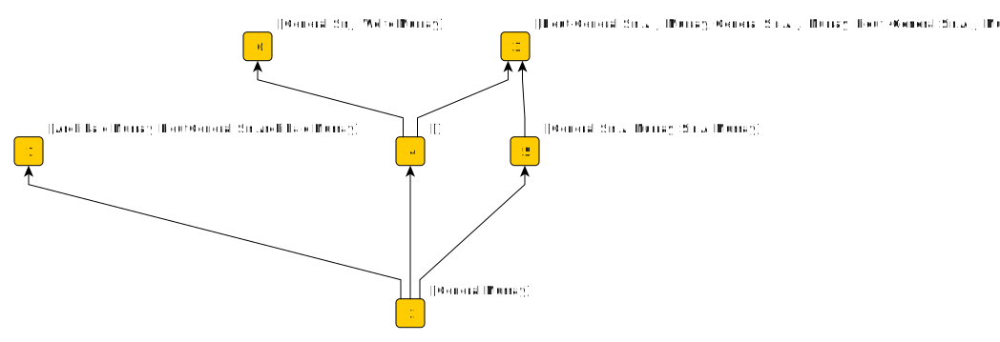

# Names

The name of the same person can be expressed in many different ways. Resolving which expressions are equivalent is _entity disambiguation_.

I can take a name and split it up into tokens. Each name is then associated with a set of tokens and similar names are related by intersections of
these sets. I can play around with options for generating tokens. For example, it might make sense to normalize the tokens in various ways: reduce everything
to lower case, remove diacritical marks, apply a phonetic encoding (such as [Soundex](https://en.wikipedia.org/wiki/Soundex)), and so on.
I can add one or modified tokens to each set in addition to the original tokens, or I can replace original tokens with the modified ones.
I can make a [stop list](https://en.wikipedia.org/wiki/Stop_word) of tokens that won't help me discriminate and discard them.
There are lots of options that might let me "tune" any follow-on analysis, but the result in any case is data structure consisting of a set of names,
with each name associated with a set of tokens. 

I could take this data and construct a graph of name nodes linked to token nodes.
Similar names will have nodes that are [structually equivalent](https://en.wikipedia.org/wiki/Similarity_(network_science)#Structural_equivalence) in this graph.
I could score for structural similarity and use these scores to decide if two names are eqivalent. However, [that's been done](https://github.com/dstl/muc3/wiki/Extracted-Information#people),
so instead I'll play with Formal Component Anaylsis.

## FCA

Formal Component Analysis gives insight into how _objects_ are related through shared _attributes_. I could treat each name as an object and each
token as an attribute. Instead, I'll do it the other way round: Objects are tokens, and the attributes of each token are all the names in which 
that token features. This choice makes it easy to eliminate tokens that aren't discrimantory by simply deleting the object. As we'll see later,
it makes possible to add objects to influence results.

### General Murray

This example is drawn from [World War I Chronology](https://tigersmuseum.github.io/history/docs/ww1.html). As far as tokenization is concerned,
I filter against a stop list of ranks and titles, and I apply both Soundex and Metaphone to each token and add these to the set.
The complete concept lattice (for 1071 names) from the WWI chronolgy is:

To make the discussion below easier to follow, I restrict the input to just this set of names covering two different people,
[Sir Archibald James Murray](https://en.wikipedia.org/wiki/Archibald_Murray) and [Sir James Wolfe Murray](https://en.wikipedia.org/wiki/James_Wolfe_Murray):

    General Murray
    Lieut-General Sir A. J. Murray
    General Sir A. J. Murray
    Lieut.-General Sir A. J. Murray
    General Sir A. Murray
    Archibald Murray
    General Sir J. Wolfe Murray
    Sir A. Murray
    LieutGeneral Sir Archibald Murray
	

Applying FCA produces this concept lattice ...
 

 
This diagram is the GraphML procuded by the FCA implementation in my [argumentation](https://github.com/knoxa/argumentation/tree/main) repository, loaded into yEd and exported as SVG.
There isn't a layout method for lattice diagrams in yEd, so I've used a hierarchical layout and made the edges directed so that they point "upward" towards the most common attribute.
The attribute labels appear on the diagram beside concept nodes. The object labels aren't visible, but you'll see them if you open the image in a new tab and mouse over concept nodes.

What I'd like as output from entity disambiguation is a set of objects where each represents a distinct person, with their names as attributes.

Attributes on the same concept node are equivalent.
Attributes (names) towards the top of the lattice are associated with more objects (tokens) than attributes towards the bottom.
The top attributes are therefore "longer" names that tend to have more tokens.
I can argue that this makes them more likely to identify a specific individual and make a person object from each of of these top concepts.
I get three person objects from this assumption:

	Person 1
		General Sir J. Wolfe Murray
		
	Person 2
		Archibald Murray
		LieutGeneral Sir Archibald Murray

	Person 3
		Lieut-General Sir A. J. Murray
		General Sir A. J. Murray
		Lieut.-General Sir A. J. Murray

Because all the tokens relating to a name attribute are objects of the concepts below,
any name attribute associated with these lower concepts is consistent with the top concept name attribute in that it is formed from a subset of its tokens.
I can make the further assumption that all the attributes below a top concept are names of the person I've identified with the top concept. I get the
same three objects with more attributes:

	Person 1
		General Sir J. Wolfe Murray
		General Murray
		
	Person 2
		Archibald Murray
		LieutGeneral Sir Archibald Murray
		General Murray

	Person 3
		Lieut-General Sir A. J. Murray
		General Sir A. J. Murray
		Lieut.-General Sir A. J. Murray
		General Sir A. Murray
		Sir A. Murray
		General Murray

There are a couple of things to note about this result:

* In this context, the name "General Murray" is genuinely ambiguous, as evinced by its appearance as an attribute on all three person objects.
Tracing mention of the name back to the corpus shows that "General Murray" means Archibald Murray in the context of the source text.

* This output is correct if the "A" in "A. Murray" doesn't stand for "Archibald", but in fact it does. The "truth" here is two person objects; one being Person 1 above,
and the other being a union of the attributes of Person 2 and Person 3.

## Assumptions

There are two explicit assumptions described in this example concerning generating person objects from a concept lattice. There are other assumptions,
not made explicit, in how the subset of names to process is selected and in how the tokenization works. There are lots of variations that could be made on 
these themes to tune the process one way or another. In general though, we should always assume that the outputs are _claims_ not _facts_. We might 
trust a process well enough to deem its claims worth checking. We might compare various methods and look for corroboration or contradiciton.

An advantage of producing output as a putative person object with associated attrbiutes is that we can use FCA to analyse the results.

The use of Metaphone and Soundex encodings weakens the assumption that attributes higher in the concept lattice correspond to individuals.
The reason is that several name tokens will encode to the same string.
The encoded token is then a more common object than any of the source tokens that map to it.
This means it is likely to appear lower in the concept lattice with an upwards branch towards each of the different corresponding source tokens.

## Synonyms

The use of encodings such as Soundex and Metaphone allow for different transliterations or spellings of the same name. For example,

Here, "Alexandra Feodorovna" is linked to "Prince Alexander" and "Alexander" by the Soundex token "A425" at concept node 2, and "General Alexeieff"
and "General Alexeiev" are linked by the Soundex token "A421" at concept 6. All the names are linked by the Metaphone token "ALKS" at concept 4.

If I use the "top concepts are people" assumption, I get 4 people, which is wrong - General Alexeieff"
and "General Alexeiev" are the same person.

If I take out the original name token objects (leaving just the ones created by Metaphone and Soundex), I get:

This now gives me 2 people, which is again wrong - "Alexandra Feodorovna" and "Prince Alexander" are different people. The problem here is that
Soundex token "A425" doesn't distinguish between "Alexandra" and "Alexander", which is an important distinction to make in this context.

